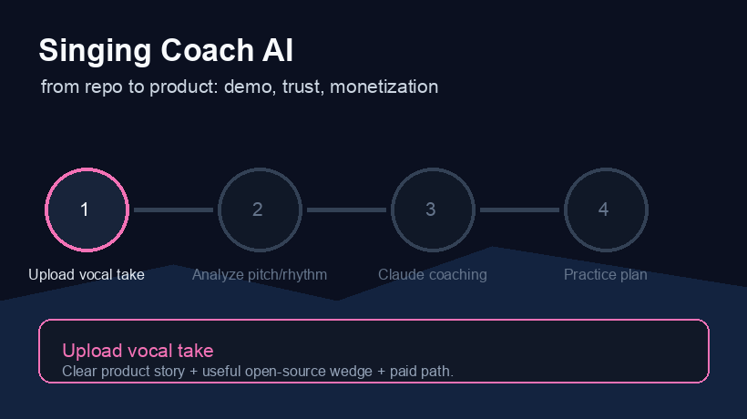

# singing-coach-ai

Feed it a recording of yourself singing, get back actual coaching feedback — not just numbers.

Works with audio files (mp3, wav, flac, m4a) and video (mp4, mov). Uses librosa to extract pitch stability, rhythm, dynamics, and spectral data, then sends the analysis to Claude to turn it into readable coaching.


---

## What it measures

**Pitch** — fundamental frequency via pyin, stability score, mean note, range in semitones, drift in Hz. The stability score matters most for beginners — below 0.85 means noticeable pitch wobble on sustained notes.

**Rhythm** — BPM estimate, beat count, regularity score. Below 0.75 usually means rushing in specific phrases.

**Dynamics** — average and peak levels in dB, dynamic range, consistency score. Below 0.7 means uneven breath support.

**Tone** — spectral centroid and MFCC features that give Claude context about vocal timbre.

---

## Architecture

```
recording.mp3 / .mp4
        │
        ▼
  audio extraction (ffmpeg, video only)
        │
        ▼
  librosa analysis
  ┌─────────────────────────────────────┐
  │  pyin pitch tracking                │
  │  beat tracking + tempo              │
  │  RMS energy / dynamic range         │
  │  spectral centroid + MFCC           │
  └─────────────────────────────────────┘
        │
        ▼
  structured JSON report
        │
        ├──→  stdout  (--no-ai mode)
        │
        └──→  Claude API (claude-opus-4-7)
                    │
                    ▼
              coaching feedback
```

---

## Setup

```bash
pip install -r requirements.txt
```

Video files also need ffmpeg:

```bash
brew install ffmpeg        # macOS
apt install ffmpeg         # Ubuntu/Debian
```

```bash
export ANTHROPIC_API_KEY=sk-ant-...
```

---

## Usage

```bash
# Full analysis with coaching feedback
python singing_coach.py my_recording.mp3

# Video works too
python singing_coach.py practice_session.mp4

# Raw numbers only — no API call
python singing_coach.py my_recording.mp3 --no-ai

# Inline API key
python singing_coach.py my_recording.mp3 --api-key sk-ant-...
```

---

## Example output

```json
{
  "file": "my_recording.mp3",
  "duration_seconds": 47.3,
  "sample_rate": 44100,
  "pitch": {
    "voiced_frames_pct": 68.2,
    "mean_hz": 220.5,
    "mean_note": "A3",
    "std_hz": 14.3,
    "pitch_range_semitones": 11.8,
    "stability_score": 0.935
  },
  "rhythm": {
    "tempo_bpm": 92.3,
    "beat_count": 71,
    "rhythm_regularity": 0.812
  },
  "dynamics": {
    "mean_db": -18.4,
    "peak_db": -6.1,
    "dynamic_range_db": 22.7,
    "consistency_score": 0.643
  }
}
```

Coaching feedback from Claude (same recording):

> Your pitch stability is strong — 0.935 on held notes is above average. The 14.3 Hz drift on sustained A3 suggests you're going sharp under breath pressure. Try dropping support slightly on the second beat of each phrase.
>
> The 0.643 dynamics consistency is your biggest gap. Your peaks are clean (-6.1 dB) but the average is quiet at -18.4 dB — the range between soft and loud passages is wider than the recording handles cleanly.

---

## Requirements

- Python 3.9+
- ffmpeg (video files only)
- Anthropic API key (skip with `--no-ai` for raw numbers)

---

## License

MIT
