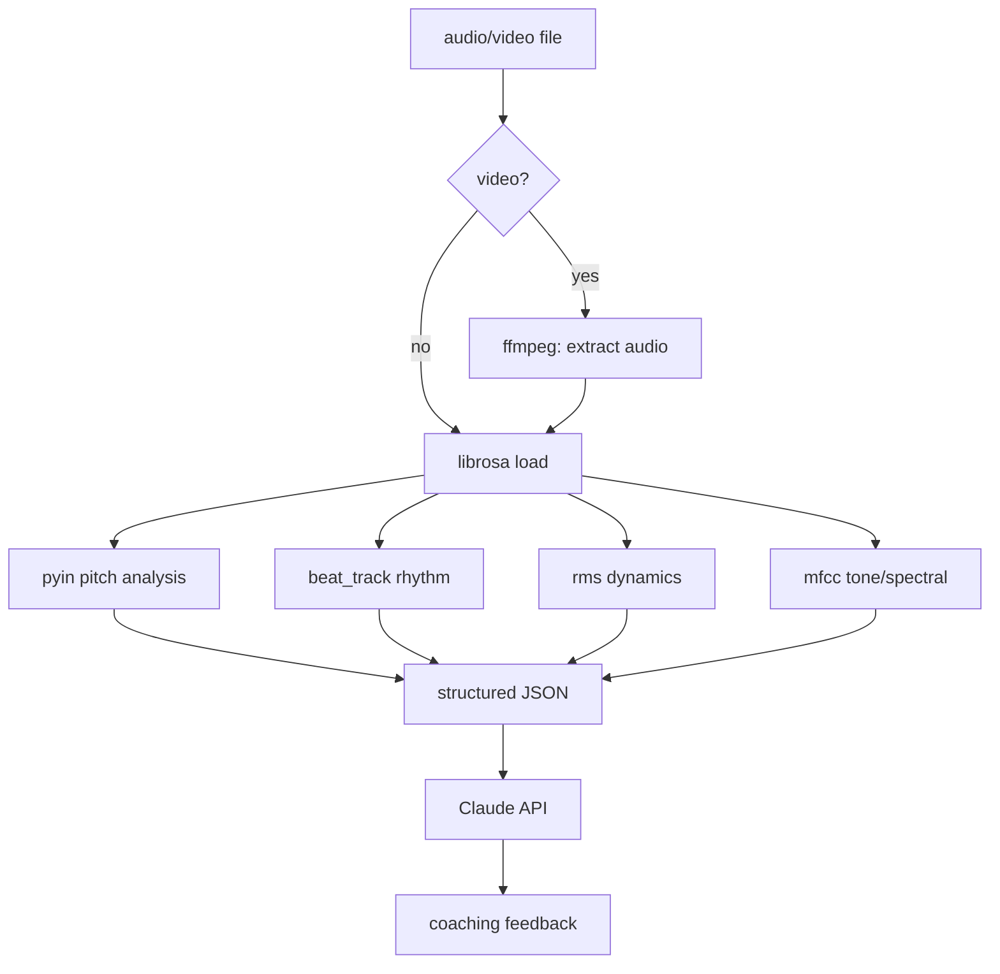
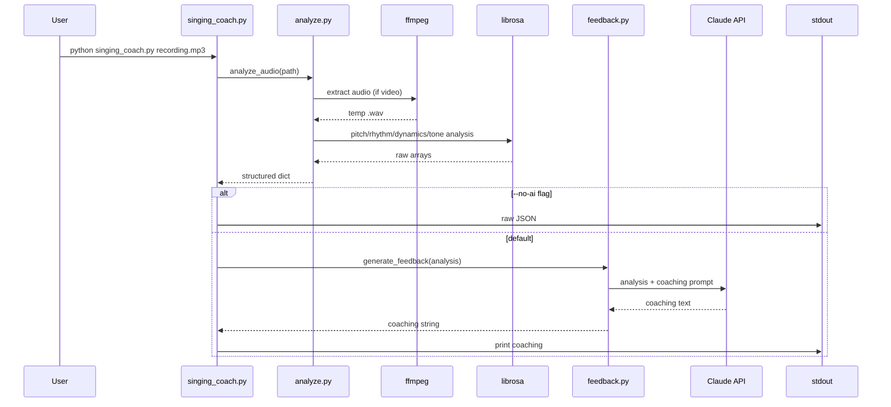
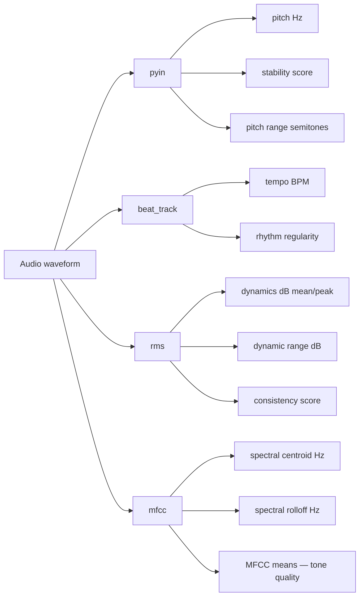

# Architecture

## Data Flow

## Analysis Pipeline Sequence

## Signal Analysis Map

## Design Decisions

**Why librosa over other libraries**
librosa is the de-facto standard for audio ML in Python. Its `pyin` algorithm is a probabilistic refinement of the YIN pitch estimator — it returns per-frame voiced/unvoiced flags alongside F0 estimates, which is exactly what you need to separate singing from silence and measure pitch stability without manual thresholding.

**Why Claude for coaching instead of rule-based thresholds**
Rule-based logic can compute numbers (stability score 0.72, range 14 semitones) but cannot turn them into actionable singing advice. Claude understands musical context: it knows that a 0.72 stability score on a long sustained note means something different than on a fast run, and it can frame feedback the way a real vocal coach would.

**Why `--no-ai` mode**
Separating analysis from feedback lets engineers run the analysis pipeline without an API key — useful for CI batch jobs, automated regression tests, or debugging the signal processing layer in isolation. The structured JSON output is deterministic and diff-able.

**Why structured JSON as the intermediate representation**
The analysis layer (`analyze.py`) is deterministic and fully unit-testable. The feedback layer (`feedback.py`) is non-deterministic AI. Keeping them separate behind a clean dict interface means you can test the analysis math precisely, mock the Claude call in tests, and swap out either layer independently.
